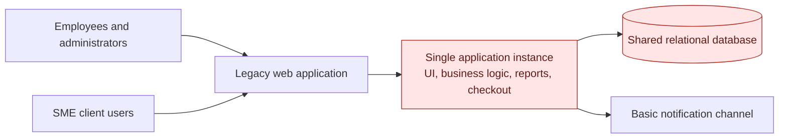
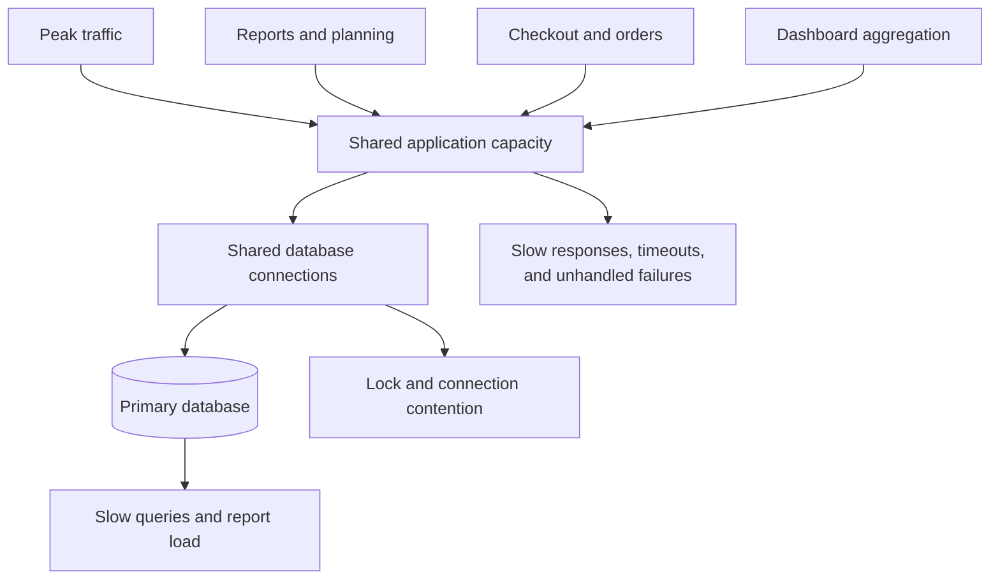

# Current architecture assessment

## Evidence limitation

> **Important:** The current architecture is inferred from the supplied audit and observed behavior. Legacy source code, deployment configuration, database schemas, and production telemetry were not available. Component boundaries and root causes must be validated during discovery.

## Inferred current architecture

## Observed behavior and likely causes

| Observed behavior | Likely architectural cause | Confidence |
| --- | --- | --- |
| Pages crash or become unavailable at peak usage | Single-instance bottleneck, blocking work, insufficient resource limits, or unhandled exceptions | Medium |
| Dashboard takes approximately 20 seconds with 200 employees | Large queries, missing indexes, repeated aggregation, N+1 access, or no cache | Medium |
| Orders and planning requests fail | Long synchronous transactions, shared resource contention, and weak retry/idempotency behavior | Medium |
| Reports fail or time out | CPU- or I/O-heavy report generation runs in request threads | High |
| Catalog lags beyond 200 items | Unbounded reads, missing pagination/indexes, or excessive payload/rendering work | Medium |
| Errors are vague | No standard error model, centralized handling, or correlation IDs | High |
| Admin activity is not auditable | No append-only audit-event path | High |
| Integrations and real-time updates are absent | Internal-only synchronous APIs and no event/webhook pipeline | High |

## Failure concentration

## Discovery needed to confirm the assessment

1. Inventory processes, deployment topology, dependencies, and versions.
2. Capture request latency, error rate, CPU, memory, and database-pool use under representative load.
3. Profile the dashboard, catalog, checkout, reports, and planning queries.
4. Review transaction boundaries, indexes, retry logic, and exception handling.
5. Map authentication, tenant ownership, secrets, and administrative access.
6. Convert confirmed findings into baselines for the proposed architecture.
