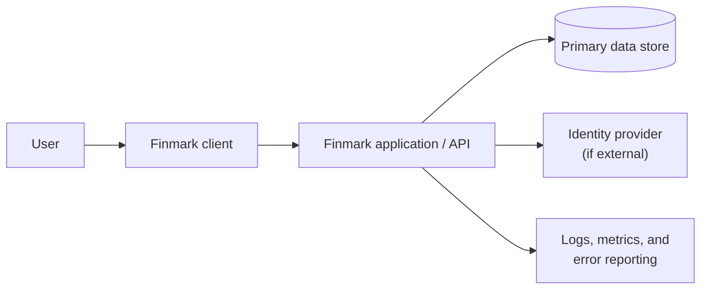
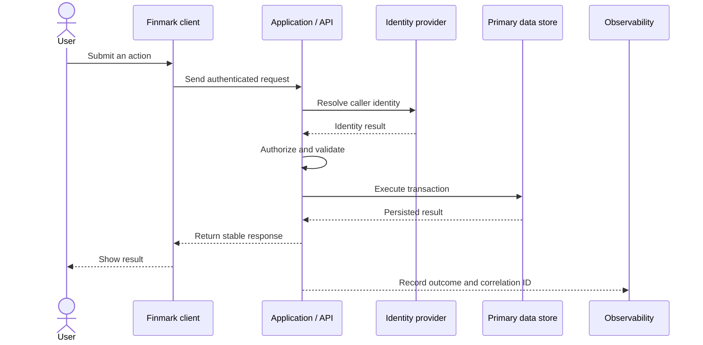

# Foundation Release architecture

## Status

Proposed scaffold. Technology and hosting choices are **TBD** and must be captured in ADRs.

## System context

## Component responsibilities

| Component | Responsibility | Does not own |
| --- | --- | --- |
| Client | Present workflows, collect input, display states | Authorization decisions or source-of-truth data |
| Application/API | Validate commands, enforce authorization, run domain rules | Long-term secrets in source code |
| Data store | Persist approved domain state and migrations | Business logic |
| Identity layer | Establish caller identity and session | Domain authorization policy |
| Observability | Capture safe operational signals | Sensitive payloads by default |

## Request flow

The application resolves identity, enforces authorization, validates input, and executes domain rules before committing a transaction. It returns a stable response and records safe operational signals for every outcome.

## Architecture principles

- The server is the authorization boundary.
- The database is the source of truth for persistent Foundation Release state.
- Validation exists at external boundaries, not only in the UI.
- Schema changes use versioned migrations.
- External integrations are isolated behind small interfaces.
- Logs contain identifiers and outcomes, not raw sensitive records.
- Complexity not required by the Foundation workflow is deferred.

## Failure modes

| Failure | Expected behavior |
| --- | --- |
| Invalid input | Reject with field-safe details; make no state change |
| Missing authentication | Return the agreed unauthenticated response |
| Failed authorization | Deny without revealing resource existence or content |
| Duplicate command | Apply agreed idempotency or conflict behavior |
| Database unavailable | Fail safely; do not report success |
| Partial write | Roll back the transaction |
| Unknown server error | Return a generic error and record a correlation ID |

## Decisions still required

- Client and application runtime
- Database and migration tool
- Hosting platform and environments
- Identity provider and session model
- Synchronous versus asynchronous work
- Observability provider and retention
