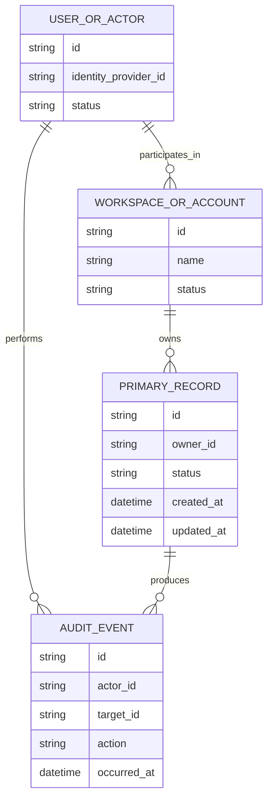

# Foundation Release data model

## Status

The domain vocabulary is not yet confirmed. The model below defines the questions and invariants the Foundation Release must resolve without inventing final entity names.

## Candidate core entities

This is a candidate relationship model. Entity names and cardinalities must be updated after ownership and collaboration rules are confirmed.

| Entity | Purpose | Key fields to confirm |
| --- | --- | --- |
| User or Actor | Identifies the person or service taking an action | Stable ID, identity-provider ID, status |
| Workspace or Account | Defines the ownership and access boundary, if required | Stable ID, name, owner, status |
| Primary Record | Represents the main object created in the Foundation journey | Stable ID, owner, domain fields, status, timestamps |
| Audit Event | Records security- or business-relevant changes, if required | Actor, action, target, time, safe metadata |

## Baseline rules

- Every persistent entity has a stable, non-guessable identifier.
- Every owned record has an explicit ownership or tenancy field.
- Created and updated timestamps are generated consistently.
- Records are not physically deleted until the retention policy is approved.
- Referential integrity is enforced where supported.
- User-supplied values are length-bounded and validated.
- Monetary values, if present, use an integer minor unit or an approved decimal representation plus currency.
- Dates, times, and time zones have explicit semantics.

## Relationship questions

- Is Finmark single-user, workspace-based, or organization-based?
- Can a user belong to multiple workspaces?
- Can a record have multiple owners or collaborators?
- Is history required, or only the latest state?
- Are records archived, soft-deleted, or permanently deleted?
- Is financial or personally identifiable information stored?

## Migration policy

1. Every schema change is represented by a versioned migration.
2. Migrations are reviewed with the application change that needs them.
3. Destructive changes require a backup and rollback or forward-fix plan.
4. Production migrations are rehearsed in a non-production environment.
5. Seed data contains no production personal or financial information.

## Data classification

| Class | Examples | Foundation handling |
| --- | --- | --- |
| Public | Published product copy | Normal storage and logging |
| Internal | Non-sensitive configuration | Access controlled |
| Confidential | User records, business data | Encrypt, restrict, avoid logs |
| Restricted | Credentials, regulated data | Dedicated secret handling; never log |
