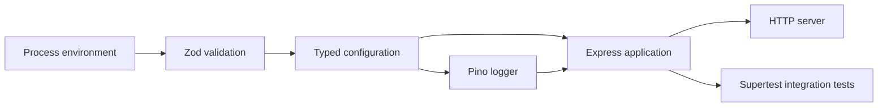

# Backend foundation

## Branch

`chore/backend-foundation`

## Goal

Establish a production-oriented TypeScript and Express foundation for the FinMark API, including validated configuration, structured logging, security middleware, request correlation, graceful shutdown, and automated tests.

## Commit history

| Commit | Purpose |
| --- | --- |
| `chore: align Node and npm versions` | Align the repository with the required Node.js and npm environment |
| `chore(backend): initialize TypeScript service` | Install backend dependencies and configure TypeScript, ESLint, build, and test tooling |
| `feat(backend): add health endpoint` | Add configuration, logging, middleware, health response, and graceful shutdown |
| `test(backend): verify health endpoint` | Verify configuration and HTTP behavior with Vitest and Supertest |
| `docs: explain backend foundation` | Document the implementation decisions, code snippets, verification, challenges, and lessons learned |

Commit subjects are used instead of hashes because hashes may change when commits are amended or rebased.

## Resulting structure

```text
backend/
├── src/
│   ├── config/
│   │   └── env.ts
│   ├── lib/
│   │   └── logger.ts
│   ├── app.ts
│   └── server.ts
├── tests/
│   ├── env.test.ts
│   ├── health.test.ts
│   └── setup.ts
├── .env.example
├── eslint.config.js
├── package.json
├── tsconfig.build.json
├── tsconfig.json
└── vitest.config.ts
```

## Application boundaries



`app.ts` creates and configures the Express application.

`server.ts` is the executable entry point that opens the configured port and handles operating-system shutdown signals.

This separation allows automated tests to exercise the application without importing the production server entry point.

## Runtime and dependency versions

The project currently targets:

```text
Node.js 25.9.x
npm 11.12.x
```

Runtime dependencies are declared in `backend/package.json`. Exact resolved versions for the complete workspace are recorded in the root `package-lock.json`.

npm may physically place backend packages in the root `node_modules` directory through workspace dependency hoisting. Dependency ownership is still determined by `backend/package.json`.

## TypeScript configuration

The backend uses:

```json
{
  "target": "ES2024",
  "module": "NodeNext",
  "moduleResolution": "NodeNext",
  "strict": true,
  "noUncheckedIndexedAccess": true,
  "exactOptionalPropertyTypes": true
}
```

`NodeNext` makes TypeScript follow Node.js native ECMAScript-module rules.

Local imports therefore use the emitted JavaScript extension:

```typescript
import { env } from "./config/env.js";
```

Although the source file is `env.ts`, the production build emits `env.js`.

The normal TypeScript configuration uses `noEmit` for static checking. `tsconfig.build.json` overrides this behavior and emits production files into `dist`.

## Runtime configuration validation

Environment variables enter Node.js as strings or `undefined`. TypeScript annotations alone cannot verify their runtime values.

FinMark uses Zod to validate and transform configuration:

```typescript
const environmentSchema = z.object({
  NODE_ENV: z
    .enum(["development", "test", "production"])
    .default("development"),

  PORT: z.coerce
    .number()
    .int()
    .min(1)
    .max(65535)
    .default(3001),

  LOG_LEVEL: z
    .enum(["fatal", "error", "warn", "info", "debug", "trace", "silent"])
    .default("info"),

  FRONTEND_ORIGIN: z
    .string()
    .url()
    .default("http://localhost:5173"),
});
```

A valid port string is transformed into a number:

```typescript
parseEnvironment({
  PORT: "4000",
}).PORT;
```

The result is `4000` as a number.

Invalid configuration throws before the server starts:

```typescript
parseEnvironment({
  PORT: "invalid",
});
```

Failing fast prevents a deployment from running with ambiguous or unsafe configuration.

The parsing behavior was extracted into a function:

```typescript
export function parseEnvironment(input: NodeJS.ProcessEnv) {
  // Validate and return typed configuration.
}

export const env = parseEnvironment(process.env);
```

This preserves production behavior while allowing configuration validation to be tested independently.

## Structured logging

FinMark uses Pino for structured JSON logs:

```typescript
export const logger = pino({
  level: env.LOG_LEVEL,

  base: {
    service: "finmark-api",
    environment: env.NODE_ENV,
  },

  redact: {
    paths: [
      "req.headers.authorization",
      "req.headers.cookie",
      "res.headers.set-cookie",
    ],
    censor: "[REDACTED]",
  },
});
```

Structured fields allow operational tooling to filter logs by service, environment, request, tenant, user, operation, and error code.

Authentication headers and cookies are redacted to reduce accidental credential exposure.

## Express middleware

Middleware is registered in this order:

```text
Request logging and request ID
        ↓
Security headers
        ↓
CORS policy
        ↓
Bounded JSON parsing
        ↓
Application routes
```

The order matters. Request logging is registered first so later failures still receive a correlation identifier.

### Request IDs

The API accepts a non-empty supplied request ID up to 128 characters or generates a UUID:

```typescript
const requestId =
  typeof suppliedRequestId === "string" &&
  suppliedRequestId.length > 0 &&
  suppliedRequestId.length <= 128
    ? suppliedRequestId
    : randomUUID();
```

The ID is returned in the response:

```text
x-request-id: learning-request-001
```

This allows a request to be correlated across a load balancer, API logs, workers, and downstream systems.

### Security headers

Helmet adds defensive HTTP headers, including:

```text
X-Content-Type-Options: nosniff
X-Frame-Options: SAMEORIGIN
Content-Security-Policy: ...
```

These headers are useful defaults, but application-specific security policy must still be reviewed before deployment.

### CORS

The configured frontend origin is the only browser origin allowed by the current policy:

```typescript
cors({
  origin: env.FRONTEND_ORIGIN,
  credentials: true,
});
```

`credentials: true` prepares the API for secure HTTP-only authentication cookies. It also means the production frontend origin must be explicit rather than using a wildcard.

### Request-body limit

JSON requests are limited to one megabyte:

```typescript
express.json({
  limit: "1mb",
});
```

A bounded request body reduces accidental memory pressure and basic oversized-payload abuse.

## Health endpoint

The first functional route is:

```http
GET /health
```

Response:

```json
{
  "status": "ok",
  "service": "finmark-api"
}
```

The endpoint currently proves that the application process can receive and answer HTTP requests.

It is a liveness endpoint, not a complete readiness endpoint. A future readiness check should report whether required dependencies such as PostgreSQL, Redis, and RabbitMQ are available.

## Graceful shutdown

The server listens for `SIGTERM` and `SIGINT`:

```typescript
process.once("SIGTERM", () => {
  shutdown("SIGTERM");
});

process.once("SIGINT", () => {
  shutdown("SIGINT");
});
```

During shutdown, the server:

1. Stops accepting new connections.
2. Allows active HTTP work to finish.
3. Logs the shutdown result.
4. Forces termination after ten seconds if graceful shutdown stalls.

This behavior supports container termination and rolling deployments.

## Testing strategy

Vitest runs the test suite. Supertest exercises the Express application through a temporary ephemeral HTTP listener.

The tests do not:

- Import `server.ts`
- Bind to FinMark’s configured port `3001`
- Leave a persistent server running

The tests do create a short-lived local listener internally. Highly restricted sandboxes may need permission for local sockets.

### Environment tests

The environment suite verifies:

- Development defaults
- Port-string coercion
- Invalid-port rejection
- Invalid-origin rejection

### Health tests

The health suite verifies:

- HTTP status `200`
- JSON response body
- JSON content type
- Generated request IDs
- Supplied request-ID propagation
- Helmet security headers
- Configured CORS origin and credentials

## Validation commands

```bash
npm run typecheck --workspace @finmark/backend
npm run lint --workspace @finmark/backend
npm run build --workspace @finmark/backend
npm run test --workspace @finmark/backend
```

Final test result:

```text
Test Files  2 passed
Tests       9 passed
```

## Challenges encountered

### Application file placed in the wrong directory

`app.ts` was initially created under `src/config/`. Its relative imports therefore resolved to nonexistent paths.

Moving it to `src/app.ts` restored the intended application boundary and corrected the imports.

### `pino-http` import shape

A default import was not callable under the selected ESM and TypeScript configuration.

The package exposes a named callable export:

```typescript
import { pinoHttp } from "pino-http";
```

Using the named export also restored type inference for the request-ID callback parameters.

### Incorrect signal type import

`Signals` was initially imported from `node:os`, which does not export that type.

The correct type is available through Node’s global namespace:

```typescript
function shutdown(signal: NodeJS.Signals) {
  // ...
}
```

### Runtime and type-definition mismatch

The initial dependency installation selected Node.js 26 type definitions while the runtime was Node.js 25.

The type package was aligned with the runtime:

```text
@types/node@25
```

This prevents TypeScript from accepting Node.js APIs that may not exist at runtime.

### File-ending errors

Several files initially lacked final newlines, and `env.ts` later contained an extra blank line at the end.

The project requires exactly one terminating newline. This keeps diffs consistent and follows the repository’s `.editorconfig`.

## Possible refinements

- Add a dependency-aware readiness endpoint.
- Add centralized not-found and error middleware.
- Validate allowed request-ID characters or assign IDs only at a trusted edge.
- Support an allowlist of frontend origins when multiple deployed clients exist.
- Add request timeout and overload middleware.
- Replace direct process termination with a lifecycle abstraction that is easier to unit test.
- Add test coverage for graceful shutdown.
- Migrate to a supported even-numbered Node.js LTS release before production deployment.
- Add automated formatting to complement ESLint and EditorConfig.

## Lessons learned

- Runtime configuration requires runtime validation; TypeScript types are not sufficient.
- Application creation and network startup should remain separate.
- Middleware order changes application behavior.
- Structured logs are more operationally useful than plain strings.
- Request IDs connect user-visible failures to backend diagnostics.
- Package import behavior can differ between CommonJS and ECMAScript modules.
- Type-definition versions should match the runtime they describe.
- Integration tests can exercise real HTTP behavior without using the production server entry point.
- Automated checks and human review catch different classes of problems.
- Small, focused commits make debugging and documentation easier.
