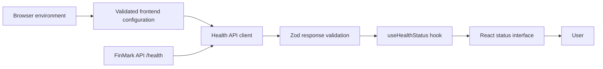
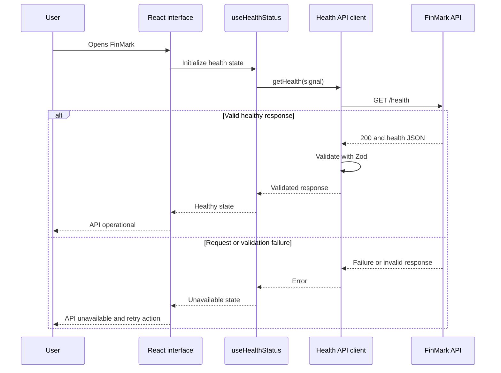

# Frontend foundation

## Branch

`chore/frontend-foundation`

## Goal

Establish a production-oriented React and TypeScript frontend for FinMark, connect it to the backend health endpoint, validate the API response at runtime, display clear service states, and verify the behavior with automated tests.

## Commit history

| Commit | Purpose |
| --- | --- |
| `chore(frontend): initialize React application` | Create the React, TypeScript, and Vite application foundation |
| `feat(frontend): add API health status` | Connect the frontend to the backend health endpoint and display loading, success, and failure states |
| `test(frontend): verify health status` | Verify the API contract, interface states, and retry behavior |
| `docs: explain frontend foundation` | Document the implementation decisions, code snippets, tests, challenges, and possible refinements |

Commit subjects are used instead of hashes because hashes may change when commits are amended or rebased.

## Resulting structure

```text
frontend/
├── src/
│   ├── api/
│   │   └── health.ts
│   ├── config/
│   │   └── env.ts
│   ├── hooks/
│   │   └── useHealthStatus.ts
│   ├── App.css
│   ├── App.tsx
│   ├── index.css
│   └── main.tsx
├── tests/
│   ├── App.test.tsx
│   ├── health-api.test.ts
│   └── setup.ts
├── .env.example
├── eslint.config.js
├── index.html
├── package.json
├── tsconfig.app.json
├── tsconfig.json
├── tsconfig.node.json
├── vite.config.ts
└── vitest.config.ts
```

The root `package-lock.json` records the exact dependency graph for all npm workspaces.

## Application boundaries



Each layer has one primary responsibility:

- `config/env.ts` validates browser-visible configuration.
- `api/health.ts` handles HTTP communication and response validation.
- `hooks/useHealthStatus.ts` manages asynchronous interface state.
- `App.tsx` renders user-visible output.
- `tests/` verifies behavior at the API and interface boundaries.

This separation prevents networking, validation, state management, and presentation from becoming tightly coupled.

## Runtime and dependencies

The frontend currently targets:

```text
Node.js 25.9.x
npm 11.12.x
React 19
TypeScript 6
Vite 8
```

The frontend declares its dependencies in `frontend/package.json`. npm workspaces may physically place these packages in the root `node_modules` directory through dependency hoisting. The frontend still owns the dependencies declared in its package file.

Node.js 25 is used to remain consistent with the required evaluation environment. It is not a long-term-support release and should be replaced with a supported even-numbered LTS version before production deployment.

## React application entry point

The application is mounted in `main.tsx`:

```tsx
createRoot(document.getElementById("root")!).render(
  <StrictMode>
    <App />
  </StrictMode>,
);
```

`StrictMode` enables additional development checks that can reveal unsafe component behavior. The non-null assertion is appropriate here because `index.html` owns and guarantees the `root` element used by the application.

## TypeScript configuration

The application enables strict type checking:

```json
{
  "strict": true,
  "noUncheckedIndexedAccess": true,
  "noUnusedLocals": true,
  "noUnusedParameters": true,
  "noFallthroughCasesInSwitch": true
}
```

Strict checking reduces assumptions about nullable, unknown, and potentially missing values. `noUncheckedIndexedAccess` makes indexed values reflect the possibility that the requested entry does not exist. Vite uses bundler-style module resolution because the browser application is transformed and bundled before delivery.

## Frontend environment validation

Vite exposes browser-visible variables through `import.meta.env`. FinMark validates the API base URL with Zod:

```typescript
const environmentSchema = z.object({
  VITE_API_BASE_URL: z
    .string()
    .url()
    .default("http://localhost:3001"),
});
```

The default supports local development without requiring a personal `.env` file. Invalid configuration is reported and prevents the application from continuing:

```typescript
const result = environmentSchema.safeParse(import.meta.env);

if (!result.success) {
  console.error(
    "Invalid frontend environment configuration:",
    z.treeifyError(result.error),
  );

  throw new Error("Invalid frontend environment configuration.");
}
```

Failing early makes a deployment configuration error easier to diagnose than a generic network failure later. Variables prefixed with `VITE_` are included in browser-delivered code, so they must never contain credentials or other secrets.

## Health API client

The API client sends:

```http
GET /health
Accept: application/json
```

The expected response is:

```json
{
  "status": "ok",
  "service": "finmark-api"
}
```

TypeScript types cannot prove that an external HTTP response has the expected structure at runtime. The response is therefore validated with Zod:

```typescript
const healthResponseSchema = z.object({
  status: z.literal("ok"),
  service: z.literal("finmark-api"),
});

export type HealthResponse = z.infer<typeof healthResponseSchema>;
```

The schema provides runtime validation of received JSON and a derived TypeScript type for application code. The response body begins as `unknown`:

```typescript
const payload: unknown = await response.json();
```

Treating external data as `unknown` prevents the application from trusting it before validation. The client also rejects non-successful HTTP status codes:

```typescript
if (!response.ok) {
  throw new Error(
    `Health request failed with status ${response.status}.`,
  );
}
```

A response can fail because the server is unreachable, the server returns a non-successful status, the body is malformed JSON, or valid JSON violates the expected contract. The API client converts these conditions into rejected promises for the state layer to handle.

## Request lifecycle



## Health state model

The hook uses a discriminated union:

```typescript
type HealthState =
  | { status: "loading" }
  | { status: "healthy"; service: string }
  | { status: "unavailable"; message: string };
```

This prevents invalid combinations such as a loading state with an error message or a healthy state without a service name. React narrows the available properties after checking `state.status`.

## Cancellation and retry

Each health check creates an `AbortController`, and the effect cleanup cancels the request:

```typescript
const controller = new AbortController();

void getHealth(controller.signal);

return () => {
  controller.abort();
};
```

This protects the component from obsolete network work when it unmounts or its effect is replaced. An intentional abort is not displayed as a service failure.

When a request fails, the interface exposes a `Check again` button. Its handler resets the visible state and increments the attempt counter:

```typescript
function checkAgain() {
  setState({ status: "loading" });
  setAttempt((currentAttempt) => currentAttempt + 1);
}
```

Because the effect depends on `attempt`, changing it starts a new health request without requiring a page reload.

## Accessible status feedback

The status container uses:

```tsx
<section className="health-card" aria-live="polite">
```

`aria-live="polite"` allows assistive technology to announce the asynchronously updated status without immediately interrupting the user. The retry control is a native button, preserving keyboard interaction, focus behavior, and button semantics. Loading, healthy, and unavailable states use visible text rather than relying on color alone.

## Testing strategy

Vitest runs the test suite in a jsdom browser simulation. React Testing Library verifies the application through visible headings, text, and controls rather than component implementation details.

### API client tests

The API client suite verifies:

- A valid health response is accepted.
- The correct URL and request options are used.
- A non-successful HTTP response is rejected.
- JSON that violates the health contract is rejected.

### Interface tests

The React suite verifies:

- The loading state appears while the request is pending.
- A valid response produces the operational state.
- A network failure produces the unavailable state.
- The retry button starts another request.
- A successful retry restores the operational state.

The global `fetch` function is replaced with a test-controlled mock. This makes the tests deterministic and prevents them from depending on a running backend.

## Validation commands

```bash
npm run typecheck --workspace @finmark/frontend
npm run lint --workspace @finmark/frontend
npm run build --workspace @finmark/frontend
npm run test --workspace @finmark/frontend
```

Final result:

```text
Test Files  2 passed
Tests       6 passed
```

The production build transformed 99 modules successfully.

## Manual verification

The frontend was verified in the browser with the expected FinMark title and product headline, without Vite branding or browser-console errors. With the backend available, the health integration displays the operational state and identifies `finmark-api` as the connected service. Automated tests additionally verify the unavailable and successful retry paths.

## Challenges encountered

### Workspace dependency placement

Frontend dependencies appeared in the root `node_modules` directory instead of a nested frontend directory. This is expected npm-workspace behavior: npm can hoist compatible packages to the workspace root while retaining ownership in `frontend/package.json`.

### Generated scaffold cleanup

The initial Vite scaffold included demonstration assets and branding that did not belong in the FinMark product. Those assets were removed so the first committed interface represented FinMark rather than the framework used to create it.

### Dependency version alignment

The Node type definitions were aligned with the Node.js 25 runtime so TypeScript does not describe APIs from a different runtime generation.

### Loading and failure behavior

A network request does not immediately produce a result. The interface therefore needed explicit loading, success, and failure states rather than assuming the backend would always be available. A retry action supports recovery from a temporary backend outage.

### Static types versus external data

A TypeScript interface alone would make the HTTP response appear safe without inspecting the received JSON. Zod validation was added at the API boundary so runtime data must satisfy the contract the application expects.

## Possible refinements

- Replace the temporary status-focused interface with the first product workflow.
- Add routing and shared page layouts when multiple screens are introduced.
- Introduce a dedicated server-state library if caching and request coordination become complex.
- Add explicit request timeouts.
- Translate low-level network errors into clearer user-facing messages.
- Add frontend failure and performance telemetry.
- Add an application error boundary.
- Add automated accessibility checks.
- Add end-to-end tests against a running frontend and backend.
- Generate or share API types from an explicit contract to reduce frontend/backend drift.
- Migrate to a supported even-numbered Node.js LTS release before production deployment.

## Lessons learned

- npm workspaces centralize installation without removing package ownership.
- Framework-generated code should be reviewed before it becomes project history.
- TypeScript checks application code but does not validate external runtime data.
- Network requests require explicit loading, success, and failure states.
- Discriminated unions make asynchronous state transitions safer.
- Abort signals prevent obsolete requests from continuing unnecessarily.
- Retry behavior should be designed and tested as part of failure handling.
- Accessible status messages should not depend only on visual styling.
- API-boundary tests and interface tests protect different responsibilities.
- Deterministic tests should not depend on a separately running backend.
- Small commits make implementation decisions easier to inspect and explain.
