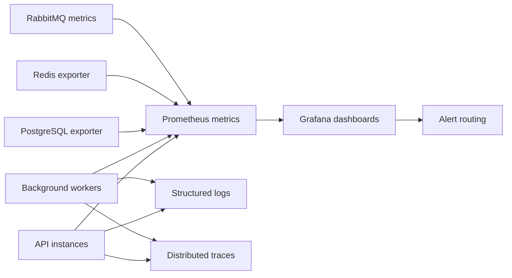

# Observability

## Objectives

Observability must explain whether FinMark is available, fast, correct, secure, and keeping up with asynchronous work. Every unexpected user-facing error should be traceable through a correlation ID.

## Signal flow

## Core metrics

| Area | Metrics |
| --- | --- |
| HTTP | Request rate, p50/p95/p99 latency, status/error rate, active requests |
| Dashboard | Render/API latency, query duration, cache hit ratio, stale-data age |
| Orders | Accepted, failed, duplicate, transaction duration, daily volume |
| Database | Query latency, locks, slow queries, connections, pool wait, storage |
| Redis | Hit ratio, latency, evictions, memory, rate-limit decisions |
| RabbitMQ | Publish rate, queue depth, oldest message, retries, dead letters |
| Workers | Job duration, success/failure, retry count, concurrency, backlog |
| Runtime | CPU, memory, event-loop delay, restarts, open handles |
| Security | Authentication failures, rate-limit actions, authorization denials, admin changes |

## Dashboards

1. Executive service health: availability, latency, error rate, and daily orders.
2. Dashboard performance: endpoint/query latency, cache behavior, and concurrency.
3. Orders and checkout: success rate, idempotency conflicts, and transaction time.
4. Data layer: PostgreSQL and Redis capacity and saturation.
5. Async processing: queue depth, job age, retries, and dead letters.
6. Security and tenancy: aggregated sign-in failures, access denials, and privileged actions.

## Alerts

Alert on sustained user impact or imminent saturation, not isolated noise. Initial alerts should cover availability failure, elevated error rate, dashboard latency above objective, database connection saturation, growing queue age, dead-letter messages, repeated worker crashes, and anomalous authentication failures. Thresholds must be tuned from load-test and early production baselines.

## Logging policy

Use structured logs with timestamp, level, service, environment, release, correlation ID, tenant ID where appropriate, actor ID where appropriate, operation, duration, and safe error code. Never log passwords, tokens, cookies, authorization headers, full financial records, or raw request/response bodies by default.
