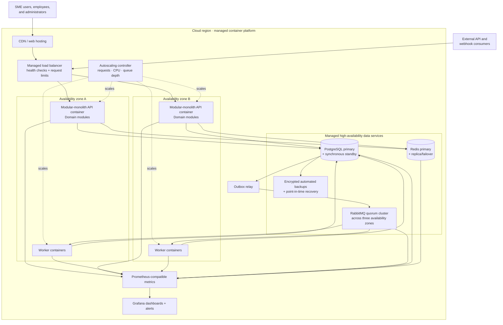
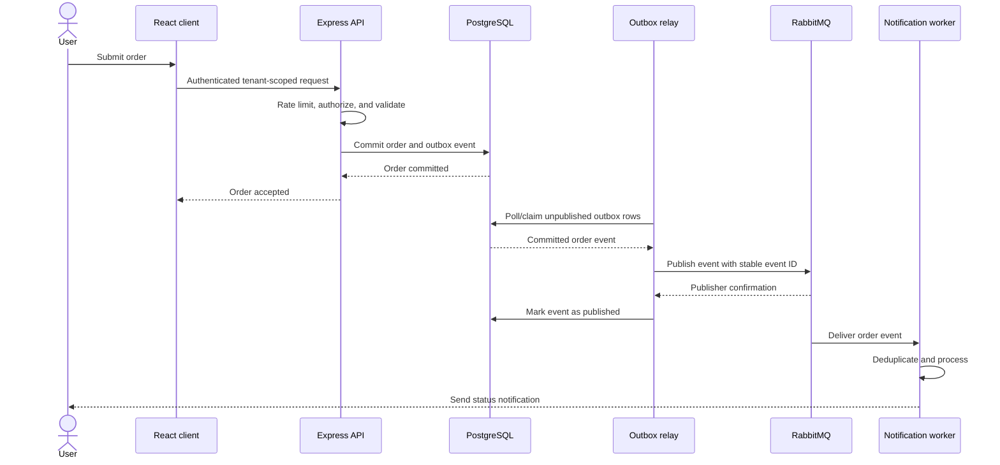

# Proposed architecture

## Architecture style

FinMark uses a modular monolith for synchronous business capabilities and event-driven background workers for long-running or fan-out work. This is an intentional alternative to premature microservices: it provides one primary deployment and transaction boundary while preserving domain seams for later extraction.

## Target architecture

The diagram shows a provider-neutral production topology. “Managed” means the selected provider must supply automated health detection, failover, maintenance, and multi-zone placement; it does not remove the need to test failure and restoration.

## Responsibilities

| Component | Responsibility |
| --- | --- |
| React frontend | Accessible workflows, client state, live updates, and safe user feedback |
| Managed container platform | Runs API and worker containers across at least two availability zones and applies autoscaling policies |
| Reverse proxy/load balancer | TLS termination, routing, health checks, request limits, load shedding, and distribution across API instances |
| Express modular monolith | Authentication boundary, tenant authorization, validation, transactions, and domain rules |
| Managed PostgreSQL HA | Authoritative state with synchronous standby/failover, encrypted backups, and point-in-time recovery |
| Managed Redis HA | Bounded caching and rate limiting with replication/failover; never required for authoritative correctness |
| RabbitMQ quorum cluster | Durable jobs and domain events replicated across three availability zones so one zone can fail without losing quorum, with bounded queues and dead-letter handling |
| Outbox relay | Reads committed outbox rows and publishes them idempotently to RabbitMQ |
| Workers | Reports, PDF/CSV export, notifications, webhooks, and expensive aggregation |
| Prometheus and Grafana | Metrics collection, dashboards, alerts, and capacity insight |

## Order flow

The API never publishes the event directly after the transaction. If it crashes after committing the order, the committed outbox row remains available to the relay. The relay and consumers are idempotent because delivery may occur more than once.

## Key design rules

- API instances remain stateless and horizontally scalable.
- API and worker containers run across at least two availability zones with minimum replica counts and graceful shutdown; RabbitMQ quorum members span three availability zones.
- Every data access path carries a verified tenant identifier.
- Order and financial writes are transactional and idempotent where retried.
- Database changes and event publication use a transactional outbox and separate relay.
- Worker retries are bounded; poison messages move to a dead-letter queue.
- Request timeouts, concurrency limits, exponential backoff with jitter, bounded queues, and load shedding prevent retry storms and unbounded resource use.
- Caches have explicit ownership, expiry, invalidation, and fallback behavior.
- Synchronous requests do not generate large reports or wait on third-party notifications.
