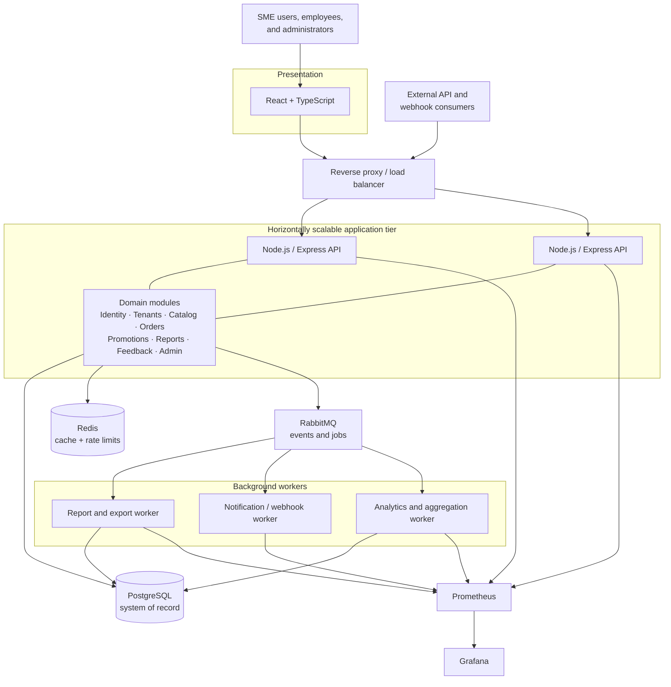
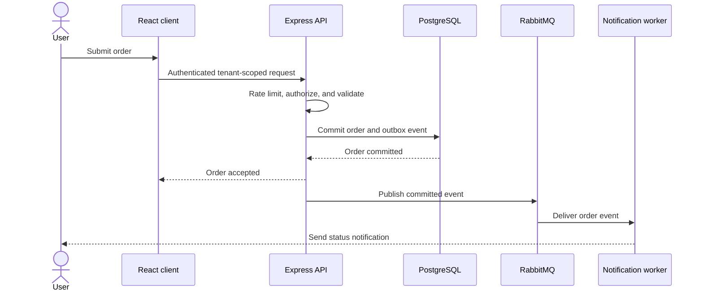

# Proposed architecture

## Architecture style

FinMark uses a modular monolith for synchronous business capabilities and event-driven background workers for long-running or fan-out work. This is an intentional alternative to premature microservices: it provides one primary deployment and transaction boundary while preserving domain seams for later extraction.

## Target architecture

## Responsibilities

| Component | Responsibility |
| --- | --- |
| React frontend | Accessible workflows, client state, live updates, and safe user feedback |
| Reverse proxy/load balancer | TLS termination, routing, request limits, and distribution across API instances |
| Express modular monolith | Authentication boundary, tenant authorization, validation, transactions, and domain rules |
| PostgreSQL | Authoritative relational state, tenant-owned data, orders, financial records, and audit events |
| Redis | Bounded caching, authentication/API rate limits, and short-lived coordination data |
| RabbitMQ | Durable jobs and domain-event distribution with retries and dead-letter handling |
| Workers | Reports, PDF/CSV export, notifications, webhooks, and expensive aggregation |
| Prometheus and Grafana | Metrics collection, dashboards, alerts, and capacity insight |

## Order flow

## Key design rules

- API instances remain stateless and horizontally scalable.
- Every data access path carries a verified tenant identifier.
- Order and financial writes are transactional and idempotent where retried.
- Database changes and event publication use an outbox-style consistency mechanism.
- Worker retries are bounded; poison messages move to a dead-letter queue.
- Caches have explicit ownership, expiry, invalidation, and fallback behavior.
- Synchronous requests do not generate large reports or wait on third-party notifications.
