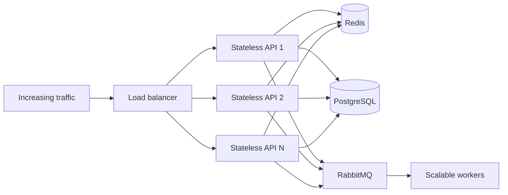

# Scalability and reliability

## Capacity targets

- At least 200 concurrent employee users
- Growth from 500 to 3,000 daily orders
- Operational dashboard under three seconds at an agreed percentile
- Catalog operations remain responsive beyond 200 inventory items

## Scaling strategy

## Performance design

- Paginate and filter catalog and order collections at the database boundary.
- Index tenant, status, date, and relationship columns used by critical queries.
- Precompute or incrementally update dashboard aggregates where live queries are too expensive.
- Cache only measured hot reads and use tenant-aware cache keys.
- Return job identifiers for report, export, and planning work that exceeds the request budget.
- Bound database connections per instance and measure pool saturation.
- Compress responses and avoid sending unused dashboard or catalog fields.

## Reliability patterns

| Risk | Pattern |
| --- | --- |
| API instance failure | Health checks, multiple instances, load-balancer removal, and graceful shutdown |
| Duplicate order request | Idempotency key and transactional uniqueness |
| Partial order state | Database transaction |
| Database/event inconsistency | Transactional outbox and retryable publisher |
| Worker failure | Acknowledgement after success, bounded retry, and dead-letter queue |
| Dependency slowdown | Timeouts, concurrency limits, and circuit breaking where justified |
| Cache failure | Database fallback and no correctness dependency on cache |
| Deployment regression | Rolling release, smoke tests, metrics observation, and rollback |

## Performance validation

Test representative tenant sizes and realistic read/write mixes. Record p50, p95, and p99 latency; throughput; error rate; CPU and memory; event-loop delay; database query time; connection-pool saturation; cache hit ratio; and queue depth. A test passes only when the dashboard target and order capacity are met without unsafe error or resource saturation.
