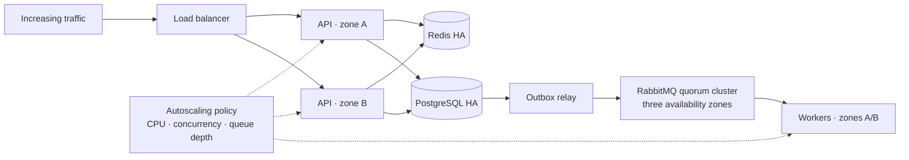

# Scalability and reliability

## Capacity targets

The business targets are fixed; the peak-load profile below is an initial engineering target that must be calibrated with production evidence.

| Measure | Initial target |
| --- | --- |
| Concurrent employee users | 200 active users |
| Daily orders | 3,000 orders per day |
| Sustained peak API traffic | 25 requests/second for 30 minutes |
| Burst API traffic | 50 requests/second for 5 minutes without unsafe errors |
| Sustained order creation | 5 orders/second for 15 minutes |
| Dashboard objective | p95 server response under 3 seconds for 200 concurrent users during a 30-minute test |
| Dashboard user experience | p95 usable dashboard render under 5 seconds using the documented client and network profile |
| Dashboard dataset | 100 tenants, 1,000,000 historical orders, and 10,000 catalog items per large tenant |
| Server-test condition | Generate API load from the deployment region with both warm-cache steady state and a documented cold-cache run |
| Browser-test profile | Representative mid-range client, 10 Mbps download, 2 Mbps upload, and 100 ms round-trip latency; record the exact device/browser profile with results |
| Catalog objective | p95 response under 2 seconds for filtered, paginated access to 10,000 tenant items |
| Queue recovery | Drain a 10,000-job backlog within 30 minutes after workers recover, without breaching API latency objectives |

These targets are deliberately more demanding than the daily average so the design is validated against concentration and bursts rather than daily totals alone.

## Scaling strategy

API autoscaling uses concurrent requests and CPU with a minimum of two healthy replicas across zones. Worker autoscaling uses queue depth and oldest-message age. Scale-in must honor graceful shutdown, connection limits, and in-flight job completion.

## Performance design

- Paginate and filter catalog and order collections at the database boundary.
- Index tenant, status, date, and relationship columns used by critical queries.
- Precompute or incrementally update dashboard aggregates where live queries are too expensive.
- Cache only measured hot reads and use tenant-aware cache keys.
- Return job identifiers for report, export, and planning work that exceeds the request budget.
- Bound database connections per instance and measure pool saturation.
- Compress responses and avoid sending unused dashboard or catalog fields.

## Overload behavior

| Control | Behavior |
| --- | --- |
| Request deadline | Every inbound and outbound operation has a bounded timeout; work is cancelled or abandoned safely after expiry |
| Concurrency limit | Each instance limits in-flight requests and dependency calls before resource exhaustion |
| Load shedding | Low-priority analytics and export submissions return `429` or `503` with `Retry-After` when capacity is exhausted |
| Queue bound | Each queue has a maximum length or byte policy plus an explicit overflow/dead-letter decision |
| Retry policy | Exponential backoff with jitter and a strict retry budget; permanent failures do not retry |
| Backpressure | Producers slow or reject optional work when queue age or depth crosses the safe threshold |
| Autoscaling ceiling | Scaling has a tested maximum that respects database connections and downstream capacity |

## Reliability patterns

| Risk | Pattern |
| --- | --- |
| API instance failure | Health checks, multiple instances, load-balancer removal, and graceful shutdown |
| Availability-zone failure | Replicas across at least two zones and provider-managed data-service failover |
| Duplicate order request | Idempotency key and transactional uniqueness |
| Partial order state | Database transaction |
| Database/event inconsistency | Transactional outbox, separate idempotent relay, and publisher confirmation |
| Database primary failure | Managed standby promotion, connection recovery, and rehearsed failover |
| Data loss or corruption | Encrypted automated backups, point-in-time recovery, and scheduled restore tests |
| Worker failure | Acknowledgement after success, bounded retry, and dead-letter queue |
| RabbitMQ node or zone failure | Quorum queues with members across three zones, a majority available after one zone fails, and confirmed publishing |
| Dependency slowdown | Timeouts, concurrency limits, and circuit breaking where justified |
| Cache failure | Database fallback and no correctness dependency on cache |
| Deployment regression | Rolling release, smoke tests, metrics observation, and rollback |

## Recovery objectives

| Capability | Initial objective |
| --- | --- |
| API or worker instance loss | No user-visible outage; unhealthy instance removed within 60 seconds |
| Single-zone loss | Service restored to target capacity within 15 minutes; no committed-order data loss |
| PostgreSQL failover | RTO of 15 minutes and RPO of 0 for a normal managed standby promotion |
| Disaster or data corruption | RTO of 4 hours and RPO of 15 minutes using backups and point-in-time recovery |
| RabbitMQ interruption | Resume accepted job processing within 30 minutes; committed outbox events remain recoverable |
| Large worker backlog | Drain 10,000 queued jobs within 30 minutes of restored worker capacity |

RTO and RPO are initial portfolio targets. Provider selection, cost, and stakeholder risk tolerance must confirm them before production approval. Backups are not considered valid until a restoration exercise verifies them.

## Performance validation

Test representative tenant sizes and realistic read/write mixes using the table above. Record p50, p95, and p99 latency; throughput; error rate; CPU and memory; event-loop delay; database query time; connection-pool saturation; cache hit ratio; queue depth; oldest-message age; autoscaling actions; and recovery time. A test passes only when the documented objectives are met without unsafe errors, unbounded retries, dropped committed events, or resource saturation.
