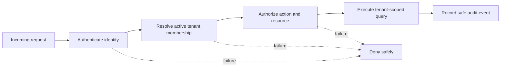

# Security architecture

## Security objectives

- Establish a trustworthy identity for every protected request.
- Prevent access across SME tenant boundaries.
- Protect credentials, financial records, orders, and personal information.
- Make administrative and security-relevant activity auditable.
- Limit automated abuse and reduce the impact of compromised credentials.

## Tenant-aware request boundary

## Required controls

| Area | Control |
| --- | --- |
| Authentication | Secure password hashing, rate limiting, session expiry, optional social login, and two-factor authentication |
| Authorization | Server-side role and resource checks using verified tenant membership |
| Database access | Tenant ID included in repository/query interfaces; optional row-level security as defense in depth |
| Input | Schema validation, size limits, normalization, parameterized queries, and safe output encoding |
| Secrets | Environment or managed secret store; no credentials in source, images, logs, or examples |
| Transport | TLS for external and sensitive internal connections |
| Webhooks | Signed payloads, timestamps, replay protection, retries, and endpoint ownership verification |
| Audit | Append-only events for sign-in, role changes, tenant administration, financial changes, and exports |
| Logging | Redact tokens, cookies, personal data, financial payloads, and authentication secrets |

## Tenant isolation validation

Automated tests must attempt cross-tenant access for every tenant-owned resource and operation. A request must not reveal whether another tenant’s resource exists. Administrative bypasses require an explicit privileged role, a documented reason, and an audit event.

## Security release gate

- Threat model reviewed for authentication, checkout, exports, integrations, and tenant access.
- Cross-tenant test suite passes.
- Authentication rate limits and lockout behavior are verified.
- Secret and dependency scans have no unresolved critical finding.
- Logs and traces contain no sensitive request bodies or credentials.
- Audit records are queryable and protected from ordinary mutation.
